# Quarry KB Project Plan

## Purpose

This document is the project-level progress view for Quarry KB. It answers one question: **what is complete, what is usable, and what remains before the next milestone?**

This is a coordination and release-readiness view. Slice SDD documents remain the source of truth for requirements, behavior, architecture, design, and implementation tasks.

## Status Legend

| Status | Meaning |
|---|---|
| `Not started` | No implementation or approved slice exists yet |
| `In progress` | Work is active, but the exit gate is not satisfied |
| `Functional` | The capability runs locally and its primary path works |
| `Verified` | Automated checks and manual acceptance pass |
| `Pilot ready` | Verified, documented, recoverable, and ready for department use |
| `Blocked` | Progress requires an external decision, dependency, or recovery action |

## Overall Project Flow

```mermaid
flowchart LR
    P0["P0 Product baseline<br/>Scope, personas, acceptance set, SDD slices"]
    P1["P1 Engineering foundation<br/>FastAPI, Vue, PostgreSQL/pgvector, Compose"]
    P2["P2 Identity and authorization<br/>JWT, roles, account lifecycle, audit"]
    P3["P3 Knowledge ingestion<br/>Upload, parsing, OCR, chunking, embeddings"]
    P4["P4 Knowledge browse and admin<br/>Documents, chunks, status, reindex, providers"]
    P5["P5 RAG answering<br/>Hybrid retrieval, citations, sessions, provider switch"]
    P6["P6 Reliability and security<br/>Degradation, timeouts, egress, backup, observability"]
    P7["P7 Department pilot<br/>Real corpus, quality evaluation, rollout, feedback loop"]
    P8["P8 Follow-on product<br/>SSO, Agent, Wiki, multiple knowledge bases"]

    P0 --> P1 --> P2 --> P3 --> P4 --> P5 --> P6 --> P7 --> P8
```



## Current Baseline

| Stage | Current status | Evidence / gap |
|---|---|---|
| P0 Product baseline | `In progress` | Product specification v0.1.5, positioning, prototype, fixed evaluation question set, gateway boundary ADR, and a draft `repo-bootstrap` SDD chain exist. Document-quality review is `Ready with minor fixes`; product/slice acceptance is still pending. |
| P1 Engineering foundation | `Not started` | Application scaffolding is not present. |
| P2 Identity and authorization | `Not started` | No backend or frontend implementation. |
| P3 Knowledge ingestion | `Not started` | No parser, OCR, embedding, or worker implementation. |
| P4 Knowledge browse and admin | `Not started` | No application implementation. |
| P5 RAG answering | `Not started` | No retrieval or chat implementation. |
| P6 Reliability and security | `Not started` | No runtime verification or deployment baseline. |
| P7 Department pilot | `Not started` | No pilot release exists. |
| P8 Follow-on product | `Deferred` | Explicitly outside v0.1. |

## Stage Gates

| Stage | Scope | The stage is complete only when... |
|---|---|---|
| P0 | Product and delivery baseline | The v0.1 scope is accepted; the evaluation question set exists; the first implementation slice has a complete SDD chain; external gateway contracts and data-egress assumptions are recorded. |
| P1 | Engineering foundation | Compose starts `web`, `api`, and `postgres`; health checks work; migrations run; environment configuration is externalized; a frontend-to-backend smoke path passes. |
| P2 | Identity and authorization | Admin can create/deactivate users and assign exactly one role; JWT sessions work; server-side authorization passes for Admin/Editor/Viewer; deactivated sessions are rejected; audit records are created. |
| P3 | Knowledge ingestion | Editor/Admin can upload Markdown, TXT, PDF, and DOCX; files stay on the configured volume; parsing status is observable; scanned pages use internal-gateway OCR; embeddings use the internal gateway only; failed documents retain a retry/reindex path. |
| P4 | Browse and administration | Users can search/filter documents, inspect metadata and chunks, and view parse mode; Admin can manage chat providers; Browse works without the internal gateway; secrets are never returned to users. |
| P5 | RAG answering | Hybrid keyword/vector retrieval works; relevance thresholds prevent unsupported answers; answers contain stable citations; cited source context opens; sessions are private and persistent; provider/model is recorded per answer; user-level provider switching works. |
| P6 | Reliability and security | Gateway outage behavior matches the product contract; keyword-only fallback is visible; no silent provider failover occurs; timeouts and retries are bounded; sensitive logs are redacted; backup/restore and migration smoke checks pass. |
| P7 | Department pilot | A representative mock or approved pilot corpus is indexed; the evaluation set meets the agreed quality bar; onboarding and recovery runbooks exist; pilot users complete key flows; feedback is captured and prioritized. |
| P8 | Deferred expansion | Only begins after pilot evidence supports the next capability, with a new approved SDD slice and ADR where architecture changes. |

## Progress Rule

For reporting, count a stage only when its exit gate passes:

```text
Project progress = verified stages P0–P7 / 8
Pilot readiness = P0–P7 all at Pilot ready
```

Do not count code that merely exists. A stage can be reported as `Functional` before it becomes `Verified`, but it must not be presented as complete until the gate passes.

## Recommended Slice Order

1. `foundation-auth`
2. `knowledge-ingest`
3. `knowledge-browse-admin`
4. `retrieval-rag`
5. `pilot-hardening`

Each slice should update its corresponding requirements, stories, specification, architecture/data flow/data model, design/API guide, tasks, and traceability documents before implementation.

## Explicitly Deferred Until After the Pilot

- Company SSO
- Agent / ReAct workflows
- Wiki distillation
- Multiple knowledge bases or workspaces
- IM integrations
- Public embedding or OCR services
- Streaming output
- Object storage migration

## Update Procedure

After each milestone:

1. Update the stage status and evidence in this file.
2. Link the relevant SDD slice and verification commands.
3. Record open risks and blocked decisions.
4. Mark the stage `Verified` only after automated and manual checks pass.
5. Mark P7 `Pilot ready` only after the pilot corpus, quality evaluation, recovery path, and onboarding material are ready.
