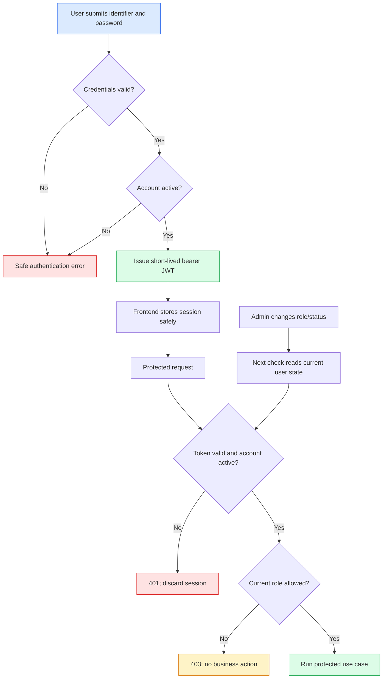

# Feature Specification: Password Authentication and JWT Authorization

> **Source stories:** US-AUTH-001 through US-AUTH-004
> **Spec status:** Draft
> **Last updated:** 2026-07-26

---

## Overview

**Feature summary:**
The slice adds local account/password authentication, short-lived JWT access sessions, Admin-managed account lifecycle, and server-side authorization for the three product roles.

**Business objective:**
Establish trustworthy identity and ownership before knowledge upload, retrieval, chat, and audit slices are implemented.

**In-scope outcome:**
An Admin can provision accounts, active users can log in, protected APIs can resolve the current user and current role, deactivation is effective on the next request, and the frontend can display and discard a safe session.

## Source Documents

- `docs/01-requirements/auth-password-jwt-requirement.md`
- `docs/02-user-stories/auth-password-jwt-user-stories.md`
- `docs/01-requirements/quarry-kb-product-spec-v0.1.md` — FR-01 to FR-07, FR-50 to FR-51, SEC-01/02, AC-01/02
- `docs/00-context/decisions/ADR-0002-lock-technology-stack-and-auth-evolution.md`
- `docs/00-context/changes/20260726-repo-bootstrap/archive.md`
- `docs/standards/backend.md` and `docs/standards/frontend.md`

## Actors / Users

| Actor | Responsibility |
|---|---|
| Admin | Creates and manages accounts; can use authenticated product capabilities in later slices. |
| Editor | Authenticated role reserved for future knowledge ingestion. |
| Viewer | Authenticated role reserved for future browse/query/Ask capabilities. |
| Unauthenticated visitor | Can log in and reach infrastructure health probes only. |
| Future SSO provider | Not integrated; only the mapping field is reserved. |

## Functional Scope

### Authentication

- **FR-AUTH-001**: The system accepts an account identifier and password at the login boundary and returns a bearer JWT only for an active account with a valid password. *(Source: FR-01)*
- **FR-AUTH-002**: The system stores a password hash, never plaintext password material. *(Source: FR-02)*
- **FR-AUTH-003**: Authentication failures are intentionally non-distinguishing for unknown identifier, invalid password, and inactive account. *(Derived from SEC-02 and account privacy; proposed default)*

### Identity and roles

- **FR-AUTH-004**: Every account has exactly one role from `Admin`, `Editor`, `Viewer`. *(Source: FR-04)*
- **FR-AUTH-005**: Every account has a stable internal `user_id`, a unique account identifier, display name, status, timestamps, and nullable `external_subject`. *(Source: FR-06 and domain concept User)*
- **FR-AUTH-006**: Authorization decisions use the current internal user record, not an untrusted role claim copied from an old token. *(Source: FR-07 and FR-51)*

### Account administration

- **FR-AUTH-007**: An Admin can create an active account with identifier, display name, initial password, and exactly one role. *(Source: FR-03 and product scope §4.1)*
- **FR-AUTH-008**: An Admin can list accounts with safe identity, role, status, and timestamps. *(Source: FR-50)*
- **FR-AUTH-009**: An Admin can assign a new role, deactivate an account, and reactivate an account. *(Source: FR-03 and FR-51)*
- **FR-AUTH-010**: A deactivated account cannot log in and an existing token is rejected on the next protected request. *(Source: FR-05)*

### Boundary enforcement

- **FR-AUTH-011**: Login is public; future business endpoints require a valid token associated with an active account. *(Source: SEC-01)*
- **FR-AUTH-012**: The P0 infrastructure health endpoints remain the explicit no-token exception from ADR-0005 and do not imply business authorization.
- **FR-AUTH-013**: Frontend guards may hide or redirect UI, but server-side authorization is the security boundary. *(Source: FR-07)*

## Non-Functional Requirements

- **Security:** Password hashing must use a current password-hashing library with a deliberately configured work factor; plaintext password, password hash, JWT, bearer header, and secret-shaped values must not appear in logs or responses.
- **Security:** JWT signing material must be injected at runtime and must fail closed when missing in a non-local environment. `[DEFAULT - algorithm and key rotation require owner confirmation]`
- **Reliability:** A deactivation must be observed on the next protected request without waiting for token expiry. A current-user lookup is therefore part of protected-request authorization.
- **Consistency:** A role change must be used on the next authorization check; the role claim in a previously issued token is not authoritative.
- **Privacy:** Login failures must not disclose whether an account exists. User list and current-user responses must exclude password hashes, tokens, external provider credentials, and internal secret values.
- **Performance:** No product latency target is specified for authentication. The implementation should keep authorization lookup bounded and index-backed; a measurable target remains an open question.
- **Environment support:** Unit and API tests must run without live SSO, paid services, or external network calls. Compose/PostgreSQL migration smoke is required before implementation handoff is accepted.

## Workflow / System Flow

### Main Flow

1. The user submits credentials to the public login endpoint.
2. The API normalizes the account identifier according to the approved identifier rule, loads the user, verifies the password hash, and checks active status.
3. On success, the API issues a short-lived JWT access token and safe current-user data. On failure, it returns one generic authentication error.
4. The frontend keeps the token in the approved session mechanism and requests the current-user profile on startup.
5. A protected request validates the token, resolves the current internal user, checks active status, and evaluates the current database role.
6. An Admin account operation commits atomically. The next authorization check observes its new role/status.
7. Logout discards the browser token. Deactivation rejects an unexpired token on the next protected request.

## Data / Configuration Requirements

### Key Entities

| Entity | Description | Key attributes |
|---|---|---|
| User | Local account and authorization owner | `user_id`, identifier, display name, role, status, password hash, nullable `external_subject`, session/auth version, timestamps |

### Configuration

- JWT signing key material: runtime secret; required outside local development.
- JWT algorithm: `[DEFAULT]` HS256 for the single-host pilot unless an approved security decision selects asymmetric signing.
- Access token lifetime: `[DEFAULT]` 30 minutes; no refresh token in this slice.
- Password hashing work factor: configured by the password adapter; exact library/work factor must be pinned in implementation review.
- Password policy: `[DEFAULT]` minimum 12 characters, no plaintext logging, no complexity regex unless product owner changes the rule.

### Status and Role Models

- Account status: `active` ↔ `deactivated`; only Admin can trigger transitions.
- Roles: `Admin`, `Editor`, `Viewer`; exactly one value per account.
- Authorization transition: an account role/status change is effective on the next protected request.

### Validation Rules

- Account identifier is non-empty after trimming and uses the approved normalization rule.
- Role must be exactly one of the three role values.
- Password must satisfy the approved policy and is never echoed in a response.
- An account identifier must be unique under normalized comparison.
- `external_subject` is nullable and not writable through the phase-one password UI.

## Integrations

### PostgreSQL / Alembic

- Persists the user record and migration metadata.
- User lifecycle changes are transactional.
- No upload, document, chunk, session, message, citation, provider, or audit tables are created by this slice.

### Browser frontend

- Calls login/current-user/admin-user APIs through the shared typed client.
- Attaches a bearer token only after a successful login.
- Never logs token or password values.

### External identity provider

- None in this slice. `external_subject` is a schema reservation only.

## Error Contract

The API uses the P0 envelope: `success`, `data`, `error`, and `meta`.

| Code | HTTP | Meaning |
|---|---:|---|
| `AUTHENTICATION_FAILED` | 401 | Identifier/password invalid or account inactive; intentionally non-distinguishing. |
| `TOKEN_INVALID` | 401 | Missing, malformed, expired, or unverifiable bearer token. |
| `ACCOUNT_INACTIVE` | 401 | Token maps to a currently deactivated account. |
| `FORBIDDEN` | 403 | Authenticated account lacks the required current role. |
| `ACCOUNT_CONFLICT` | 409 | Normalized identifier already exists. |
| `VALIDATION_ERROR` | 422 | Request fields violate the approved input rules. |
| `USER_NOT_FOUND` | 404 | Admin target user does not exist; no secret data is disclosed. |

## Dependencies

### Upstream

- Verified `repo-bootstrap` runtime, migration, API envelope, and frontend client baseline.
- ADR-0002 role and password-to-SSO evolution decision.
- ADR-0005 health-probe authorization exception.

### Downstream

- `knowledge-ingest` uses `user_id` and `Admin`/`Editor` authorization.
- `ask-rag` uses authenticated user ownership for sessions.
- `chat-providers` uses Admin authorization.
- `audit-minimal` records account and role/status operations.

## Risks / Ambiguities

| ID | Description | Type | Impact | Recommendation |
|---|---|---|---|---|
| R-AUTH-001 | First Admin bootstrap path is not specified. | Gap | High | Confirm OQ-AUTH-002 before implementation. |
| R-AUTH-002 | JWT lifetime, algorithm, and browser storage are not product-locked. | Unclear | High | Approve the proposed defaults or record an ADR before apply. |
| R-AUTH-003 | Audit requirements include account actions, but audit persistence is a later slice. | Boundary | Medium | Keep audit out of this slice and make `audit-minimal` the follow-up gate. |
| R-AUTH-004 | No user retention/deletion policy is defined. | Gap | Medium | Use deactivation only for v0.1 and defer deletion/retention to a later decision. |

## Out of Scope

- SSO and all external identity network behavior.
- Knowledge and model capabilities.
- Audit table/list and provider configuration.
- Password recovery, MFA, registration, invitations, and refresh tokens.

## Open Questions

See `auth-password-jwt-requirement.md` OQ-AUTH-001 through OQ-AUTH-005. These must be accepted or explicitly defaulted before implementation handoff.
