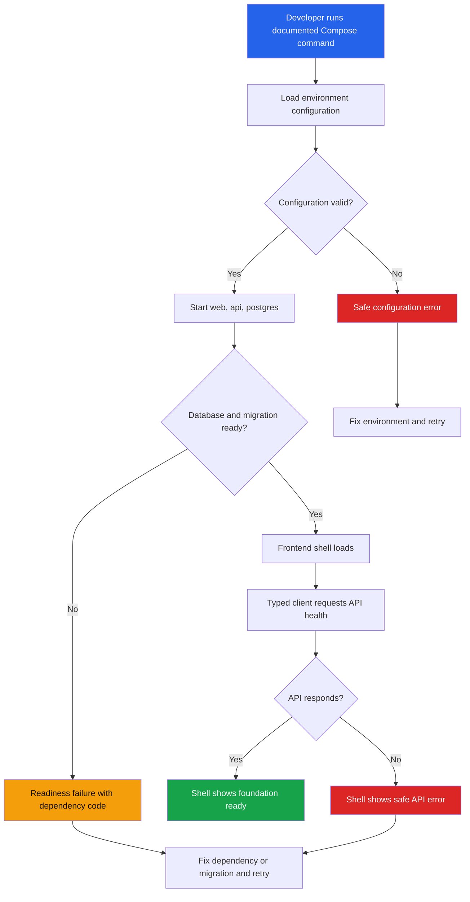

# Feature Specification: Repository Bootstrap

> **Source stories:** US-BOOT-001 through US-BOOT-005  
> **Spec status:** Draft  
> **Last updated:** 2026-07-26

## Overview

**Feature summary:**
Repository Bootstrap establishes the runnable FastAPI + Vue 3 + PostgreSQL/pgvector foundation for Quarry KB. It provides the Compose startup contract, truthful process/database readiness signals, a repeatable migration baseline, a frontend shell, and safe gateway configuration boundaries.

**Business objective:**
Give the team a reproducible foundation from which later auth, ingestion, retrieval, and pilot slices can be built and verified without re-litigating runtime or data-egress boundaries.

**In-scope outcome:**
A clean checkout can start the documented local services, apply the baseline database migration, render the frontend shell, expose separate liveness/readiness states, and validate gateway configuration without requiring live model credentials or real documents.

## Source Stories

| Story | Title / Summary | Key Capability |
|---|---|---|
| US-BOOT-001 | Start the foundation locally | Compose runtime and safe startup |
| US-BOOT-002 | Inspect truthful API readiness | Liveness/readiness boundary |
| US-BOOT-003 | Apply a safe database baseline | PostgreSQL/pgvector migration foundation |
| US-BOOT-004 | Load the frontend shell | Vue shell and typed API boundary |
| US-BOOT-005 | Configure gateway boundaries safely | Environment template and endpoint policy |

## Actors / Users

**Primary actors**

- **Developer:** Starts the local stack and runs verification.
- **Platform maintainer:** Supplies environment configuration and reviews service readiness.

**Supporting actors**

- **Compose runtime:** Starts and health-checks the three foundation services.
- **PostgreSQL/pgvector:** Provides the database capability required by later slices.

## Functional Scope

**Core capability domains:**

- **Runtime startup:** `web`, `api`, and `postgres` are documented and runnable together.
- **Operational health:** Process liveness and application readiness are distinct.
- **Database foundation:** The migration baseline validates database readiness for later vector work.
- **Frontend foundation:** The shell reaches the API through one typed client boundary.
- **Configuration safety:** Gateway settings are externalized and protected by host-policy validation.

**Lifecycle stages:**

1. Load environment configuration.
2. Start PostgreSQL, API, and web services.
3. Apply or verify the migration baseline.
4. Report liveness and readiness.
5. Render the shell and display the API health state.

**Workflow boundaries:**

- Entry point: Developer invokes the documented Compose command or starts the services separately.
- Exit point: Services are running, the baseline is applied, readiness is truthful, and the web shell reaches the API.
- Out-of-band transitions: Invalid configuration, unavailable database, missing vector capability, or failed build produce actionable failure output.

## Functional Requirements

### Runtime Startup

- **FR-BOOT-01:** The foundation exposes `web`, `api`, and `postgres` as the documented local service topology. *(Source: US-BOOT-001)*
- **FR-BOOT-02:** The API and web services fail with safe, actionable diagnostics when a required local dependency is unavailable. *(Source: US-BOOT-001)*

### Health And Readiness

- **FR-BOOT-03:** The API exposes a liveness probe that reports process health without requiring PostgreSQL or the model gateway. *(Source: US-BOOT-002)*
- **FR-BOOT-04:** The API exposes a readiness probe that reports database, migration, and configuration readiness. It does not infer gateway health without making a gateway call. *(Source: US-BOOT-002)*

### Database Foundation

- **FR-BOOT-05:** A fresh PostgreSQL database can be brought to the foundation migration state through the documented migration command. *(Source: US-BOOT-003)*
- **FR-BOOT-06:** Reapplying the baseline is safe and does not create feature data because no feature entities belong to this slice. *(Source: US-BOOT-003)*
- **FR-BOOT-07:** Missing pgvector capability prevents readiness and produces a clear diagnostic. *(Source: US-BOOT-003)*

### Frontend Shell

- **FR-BOOT-08:** The web service renders a Vue shell with a single typed API boundary for health requests. *(Source: US-BOOT-004)*
- **FR-BOOT-09:** The shell displays success and failure states from the API without exposing secrets or swallowing errors. *(Source: US-BOOT-004)*

### Configuration And Data Safety

- **FR-BOOT-10:** Runtime, database, upload-root, chat, embedding, and OCR settings are externalized in an English `.env.example` containing placeholders only. *(Source: US-BOOT-005)*
- **FR-BOOT-11:** Embedding and OCR base URLs are rejected when they do not resolve to the configured intranet/gateway allowlist. *(Source: US-BOOT-005)*
- **FR-BOOT-12:** Chat configuration is provider-neutral and does not hard-code a public vendor; provider CRUD and user switching remain outside this slice. *(Source: US-BOOT-005)*

## Non-Functional Requirements

- **Security:** No secrets, passwords, tokens, upload corpora, or runtime logs enter Git. Embedding/OCR public endpoints are rejected. *(Source: `SEC-02`, `SEC-03`, `SEC-08`, `SEC-09`, `SEC-11`)*
- **Reliability:** Readiness is dependency-aware, migration reapplication is safe, and gateway outage does not make the bootstrap health contract claim a false gateway status. *(Source: `NFR-06`, `D-07`)*
- **Environment support:** The documented local environment is Docker Compose with `web`, `api`, and `postgres`; no on-host OCR or embedding service is added. *(Source: `NFR-05`)*
- **Observability:** Health responses distinguish process, database, migration, and configuration state using safe diagnostic codes. `[INFERRED]`
- **Performance:** The shell-to-health smoke path should complete under normal local conditions without blocking on gateway calls. `[INFERRED]`

## Workflow / System Flow

### User Flow Diagram

### Main Flow

1. The developer prepares local placeholder configuration from `.env.example`.
2. The runtime starts the database, API, and web services with the documented Compose topology.
3. The database migration baseline is applied or confirmed.
4. The API exposes liveness independently from dependency readiness.
5. Readiness checks the database connection, migration state, and configuration validation. It does not call the model gateway.
6. The frontend shell loads and requests the API health state through its typed client boundary.
7. Invalid configuration, missing database capability, failed migration, or API unavailability are shown as explicit safe failure states.

## Data / Configuration Requirements

**Key entities:**

| Entity | Description | Key Attributes |
|---|---|---|
| Migration state | Tool-owned record of the applied foundation revision | Revision identifier, applied state |
| Runtime configuration | Environment-provided settings for local services and external boundaries | Environment, database URL, upload root, gateway URLs, model IDs, allowlist |

No business entities are created in this slice. User, document, chunk, session, message, citation, and audit entities belong to later slices.

**Configuration objects / parameters:**

- Runtime settings: application environment, log level, API/web ports.
- Database settings: connection URL and migration target.
- Storage setting: upload root placeholder for later ingestion; no upload behavior is implemented here.
- Chat settings: internal gateway base URL/model placeholder and secret placeholder.
- Embedding settings: internal gateway base URL, model ID, vector dimension, and secret placeholder.
- OCR settings: internal gateway base URL, model/path, timeout placeholder, and secret placeholder.
- Boundary setting: intranet/gateway host allowlist used for embedding/OCR validation.

**Statuses / state machine:**

- Liveness: `alive` or `not-running`.
- Readiness: `ready` or `not-ready` with component diagnostics for `database`, `migration`, and `configuration`.
- Configuration validation: `valid` or `invalid`.

**Validation rules:**

- Required local settings must be present and parseable.
- Embedding/OCR URLs must match the intranet/gateway allowlist.
- Public chat URLs are not treated as embedding/OCR URLs.
- Secret values are never returned in health responses or logs.

## Integrations

**External systems:**

- **PostgreSQL/pgvector:** Local database dependency for the foundation and later retrieval data.
- **Internal model gateway:** Configuration boundary only in this slice; live chat, embedding, and OCR calls are deferred.

**APIs / interfaces:**

- Frontend → API: health request over HTTP/JSON.
- API → PostgreSQL: database connectivity and migration state check.
- Future adapter → internal gateway: chat, embedding, and OCR contracts recorded by ADR-0004; not invoked by bootstrap probes.

**Credentials / secrets:**

- Database and gateway credentials are runtime secrets. The repository contains names and placeholders only.

**Dependency assumptions:**

- The local environment can obtain a PostgreSQL/pgvector-compatible image.
- OQ-09 values are supplied before live model adapter smoke tests.

## Dependencies

**Upstream dependencies**

- Product specification v0.1.5.
- ADR-0002 and ADR-0004.
- Backend and frontend standards.

**Downstream dependencies**

- `auth-password-jwt` depends on the API, database, migration, and frontend shell foundation.
- `knowledge-ingest` depends on the configuration boundary and upload-root convention.
- `ask-rag` depends on the provider-neutral chat configuration boundary and database foundation.

## Risks / Ambiguities

| # | Description | Type | Impact | Recommendation |
|---|---|---|---|---|
| R-BOOT-01 | The approved PostgreSQL/pgvector image tag is not known. | Gap | Medium | Resolve OQ-BOOT-02 before reproducible pilot deployment; use a documented local tag for development only. |
| R-BOOT-02 | Concrete gateway URLs and model identifiers are unresolved. | Gap | Medium | Keep bootstrap config placeholder-only; resolve OQ-09 before adapter smoke tests. |
| R-BOOT-03 | Health probe exposure is not yet separated from the API port. | Unclear | Low | Keep probes network-restricted and resolve OQ-BOOT-01 before deployment hardening. |
| R-BOOT-04 | No UI component library is designated. | Gap | Low | Use plain Vue and CSS variables in this slice; resolve product OQ-04 before adding a library. |

## Out of Scope

- Feature authentication, authorization, uploads, parsing, OCR, embedding, retrieval, chat, provider administration, and audit.
- Public provider network calls and production gateway smoke tests.
- Any real company document, secret, screenshot, or runtime log.

## Open Questions

| # | Question | Raised from | Owner |
|---|---|---|---|
| OQ-BOOT-01 | Should probes use a private management port? | Requirement | Platform |
| OQ-BOOT-02 | Which PostgreSQL/pgvector image tag is approved? | Requirement | Platform |
| OQ-09 | What are the exact internal gateway URLs, models, OCR path, and rate limits? | Product specification | Platform / Model gateway owner |

